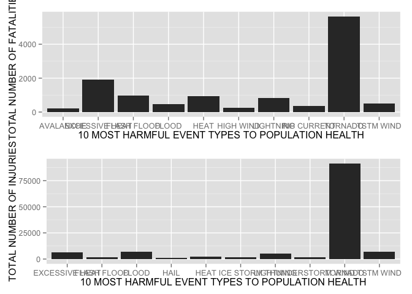
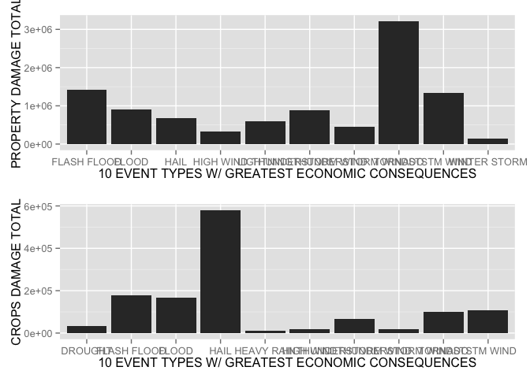

# Storm Data Analysis
David Hachuel  
September 20, 2014  
***
### Synopsis
The basic goal of this assignment is to explore the NOAA Storm Database and answer some basic questions about severe weather events.

The analysis will address the following questions:  

1. Across the United States, which types of events (as indicated in the `EVTYPE` variable) are most harmful with respect to population health?  

2. Across the United States, which types of events have the greatest economic consequences?

### Data Processing
The data set for this analysis comes in a csv file from the NOAA storm database. Let's load the data set and cache it so we don't have to repeat this process again.

```r
file_name <- "repdata-data-StormData.csv"
csv_data <- read.csv(file_name)
init_df <- data.frame(csv_data)
```

Let's clean the data set and get only the variables that are useful to answer our questions:

```r
var_names <- c("STATE", "EVTYPE", "LENGTH", "WIDTH", "FATALITIES", "INJURIES", "PROPDMG","CROPDMG")
df <- init_df[var_names]
```

Now, let's aggregate our data by EVTYPE and sum the total fatalities, injuries, property damage and crop damage. I used the plyr package for this part.

```r
library(plyr)

aggregated_df <- ddply(df, .(EVTYPE), summarize, fatalities = sum(FATALITIES), injuries = sum(INJURIES), propdmg = sum(PROPDMG),cropdmg = sum(CROPDMG))
```

**Now that we have aggregated data, we can proceed to sort the results and see the EVTYPES that had most injuries, fatalities, property and crop damage.**    

Here is the analysis for the most harmful EVTYPES to population health:

```r
library(gridExtra)
```

```
## Loading required package: grid
```

```r
library(ggplot2)

pop_health_dmg_fatalities_df <- aggregated_df[order(-aggregated_df$fatalities),]

p1 <- qplot(x=pop_health_dmg_fatalities_df$EVTYPE[1:10], y = pop_health_dmg_fatalities_df$fatalities[1:10],geom="bar", stat="identity",xlab = "10 MOST HARMFUL EVENT TYPES TO POPULATION HEALTH", ylab = "TOTAL NUMBER OF FATALITIES")

pop_health_dmg_injuries_df <- aggregated_df[order(-aggregated_df$injuries),]

p2 <- qplot(x=pop_health_dmg_injuries_df$EVTYPE[1:10], y = pop_health_dmg_injuries_df$injuries[1:10],geom="bar", stat="identity",xlab = "10 MOST HARMFUL EVENT TYPES TO POPULATION HEALTH", ylab = "TOTAL NUMBER OF INJURIES")

grid.arrange(p1,p2,ncol=1)
```

 

Here is the analysis for the EVTYPES with greatest economic consequences for both properties and crops:

```r
prop_dmg_df <- aggregated_df[order(-aggregated_df$propdmg),]

p3 <- qplot(x=prop_dmg_df$EVTYPE[1:10], y = prop_dmg_df$propdmg[1:10],geom="bar", stat="identity",xlab = "10 EVENT TYPES W/ GREATEST ECONOMIC CONSEQUENCES", ylab = "PROPERTY DAMAGE TOTAL")

crop_dmg_df <- aggregated_df[order(-aggregated_df$cropdmg),]

p4 <- qplot(x=crop_dmg_df$EVTYPE[1:10], y = crop_dmg_df$cropdmg[1:10],geom="bar", stat="identity",xlab = "10 EVENT TYPES W/ GREATEST ECONOMIC CONSEQUENCES", ylab = "CROPS DAMAGE TOTAL")

grid.arrange(p3,p4,ncol=1)
```

 

### Results
Now, from the analysis above, it is possible to say that the event types that are the most harmful to population health are: tornado, excessive heat, flood, lightning and TSTM wind.  

Regarding event types that had greatest economic consequences, we can find flash floods, floods, hail, thunderstorm winds, tornados and TSTM winds.  

